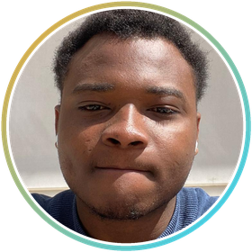

 

  

 

[🇫🇷 Français](#fr) &nbsp;·&nbsp; [🇬🇧 English](#en) &nbsp;·&nbsp; [🇹🇷 Türkçe](#tr)

<b>🇫🇷&nbsp; À propos</b>

 

Étudiant en génie informatique à l'Université Gaziosmanpaşa de Tokat (Türkiye). Je construis des applications web complètes, de l'interface au déploiement, et j'y intègre l'IA.

Je cherche un **stage d'été 2027** en intelligence artificielle, ingénierie ou gestion de projet, à Istanbul, à Tokat ou à distance.

**Langues :** français · anglais · turc · mooré · bambara

<b>🇬🇧&nbsp; About</b>

 

Computer science engineering student at Gaziosmanpaşa University in Tokat (Türkiye). I build complete web applications, from the interface to deployment, and integrate AI into them.

I am looking for a **summer 2027 internship** in artificial intelligence, engineering or project management, in Istanbul, in Tokat or remotely.

**Languages:** French · English · Turkish · Mooré · Bambara

<b>🇹🇷&nbsp; Hakkımda</b>

 

Tokat Gaziosmanpaşa Üniversitesi'nde bilgisayar mühendisliği öğrencisiyim. Arayüzden yayına kadar eksiksiz web uygulamaları geliştiriyor ve yapay zekâyı bunlara entegre ediyorum.

Yapay zekâ, mühendislik veya proje yönetimi alanında; İstanbul'da, Tokat'ta veya uzaktan **2027 yaz stajı** arıyorum.

**Diller:** Fransızca · İngilizce · Türkçe · Mooré · Bambara

## Ce que je construis &nbsp;·&nbsp; What I build &nbsp;·&nbsp; Ürettiklerim

| | Projet · Project · Proje | |
|---|---|---|
| 🌐 | **[Portfolio](https://portfolio-v2-eight-eta.vercel.app)** FR · EN · TR. Mon site, avec mon CV en trois langues. My site, with my CV in three languages. · Üç dilde CV'mle birlikte sitem. | Next.js · TypeScript |
| 🤖 | **Banc d'orchestration IA** Un manager délègue le travail à plusieurs agents (Copilot, Gemini, Codex, Ollama), route chaque tâche, bascule en cas de quota et tient un journal de délégation. AI orchestration bench · Yapay zekâ orkestrasyon test tezgâhı | PowerShell · Ollama |
| 🎓 | **[UEEMT-Tokat](https://ueemt-tokat.vercel.app)** La plateforme en ligne d'une association étudiante, avec des animations fluides. Online platform for a student association. · Bir öğrenci derneği için çevrimiçi platform. | Next.js · Supabase · Framer Motion |
| 📊 | **[CompTrack](https://comptrack-chi.vercel.app)** Une application de comptabilité pour PME, conforme au référentiel SYSCOHADA. Accounting for small businesses, SYSCOHADA. · KOBİ'ler için SYSCOHADA muhasebesi. | Next.js · TypeScript · Tailwind CSS |

## Outils &nbsp;·&nbsp; Tools &nbsp;·&nbsp; Araçlar

 

  

<i>La forge du futur — Là où le futur commence. · The forge of the future — Where the future begins. · Geleceğin demirhanesi — Geleceğin başladığı yer.</i>

